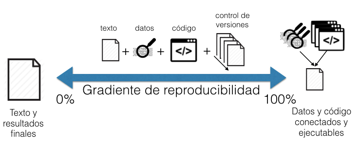
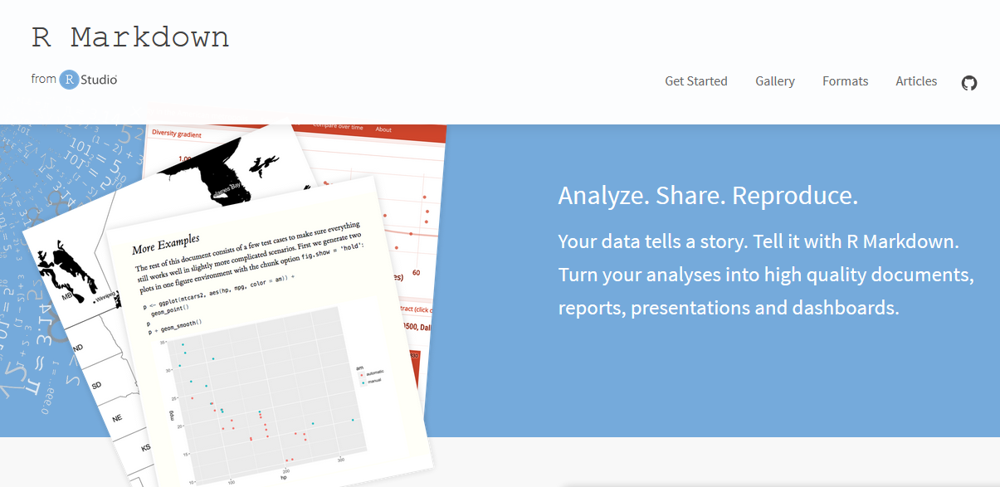

```{r knitr_setup, include=FALSE, cache=FALSE}

library(knitr)

### Chunk options ###

## Text results
opts_chunk$set(echo = FALSE, warning = FALSE, message = FALSE, eval = TRUE, size = 'footnotesize')

## Code decoration
opts_chunk$set(tidy = FALSE, comment = NA, highlight = TRUE, prompt = FALSE, crop = TRUE)

# ## Cache
opts_chunk$set(cache = TRUE, cache.path = "knitr_output/cache/")

# ## Plots
opts_chunk$set(fig.path = "knitr_output/figures/")
opts_chunk$set(fig.align = 'center')

### Hooks ###
## Crop plot margins
knit_hooks$set(crop = hook_pdfcrop)

## Reduce font size
# see http://stackoverflow.com/a/39961605
knit_hooks$set(smallfont = function(before, options, envir) {
  if (before) return(paste0("\n \\", options$size, "\n\n"))
  else return("\n\n \\normalsize \n")
  })

```


## A typical research workflow

\begincols
\begincol

1. Prepare data (**EXCEL**)

\endcol

\begincol


\endcol
\endcols


## A typical research workflow

\begincols
\begincol

1. Prepare data (**EXCEL**)

2. Analyse data (**R**)

\endcol

\begincol


\endcol
\endcols


## A typical research workflow

\begincols
\begincol

1. Prepare data (**EXCEL**)

2. Analyse data (**R**)

3. Write report/paper (**WORD**)

\endcol
\begincol


\endcol
\endcols


## A typical research workflow

\begincols
\begincol

1. Prepare data (**EXCEL**)

2. Analyse data (**R**)

3. Write report/paper (**WORD**)

4. Start the email attachments **nightmare**...

\endcol
\begincol

```{r out.height='3in', out.width='2in'}
include_graphics("images/emailmeme.jpg")
```

\endcol
\endcols


## This workflow is broken


## Problems of a broken workflow


> - How did you do this? What analysis is behind this figure? Did you account for ...?

> - What dataset was used? Which individuals were left out? Where is the clean dataset?

> - Oops, there is an error in the data. Can you repeat the analysis? And update figures/tables in Word!


----

```{r out.height='3in', out.width='4in'}
include_graphics("images/trevor_tweet.png")
```


## Our everyday scary movie

https://youtu.be/s3JldKoA0zw


# WHAT is Reproducible Science?


## Reproducible Science: WHAT 

A scientific article is **reproducible** if there is computer **code** that can **regenerate** all results and figures from the original data.

- Transparent

- Traceable

- Comprehensive

- Useful


## Most science is not reproducible

```{r out.width='4in', out.height='3in'}

```


Even **you** will struggle to reproduce **your own results** from a few weeks/months ago.


----


> You can't reproduce if you don't understand where a number came from.  
You can't reproduce what you don't remember. And trust me: you won't.  
You can't reproduce what you've lost. What if you need access to a file as it existed 1, 10, 100, or 1000 days ago?  

> *Ben Bond-Lamberty*


# WHY Reproducible Science?


----

```{r}

```

\scriptsize
Carole Goble http://www.slideshare.net/carolegoble/ismb2013-keynotecleangoble
\normalsize


----

```{r}
include_graphics("images/noamross_tweet.jpg")
```


## Reproducible Science: WHY 


> - Fundamental pillar of **scientific method**

> - Much less prone to **errors**

> - Regenerate results **automatically**

> - **Code reuse** & sharing accelerates scientific progress

> - Increasingly required by **journals**

> - Higher publication **impact** (citations, future collaborations, etc)


# HOW TO DO Reproducible Science?


## Reproducible Science: HOW

1. File **organisation**.

2. **Data management**. Spreadsheet good practices.

3. **Code-based** data analysis. **Rmarkdown**

4. Software **dependencies**.

5. **Version control** & collaborative writing.


## File organisation 

> - All files in **same directory** (Rstudio project).

> - **Raw data untouched** in independent folder.

> - Derived, **clean data** in another folder.

> - Figures, code, etc also have their own folder.


## File organisation example

```
myproject 

|- README       # general info about the project   

|- analysis.R   # master script that executes everything 

|- data-raw/    # original raw data     

|- data/        # clean data (produced w/ script)     

|- R/           # functions definitions    

|- doc/         # manuscript files     

|- figs/        # final figures    

|- output/      # other code output     
```


# Data management

```{r eval=FALSE}
## Data management

1. Planification (e.g. [DMPTool](https://dmptool.org/))

2. Collection

3. Metadata description (EML, [Morpho](http://knb.ecoinformatics.org/morphoportal.jsp), [Data Packages](http://frictionlessdata.io/))

4. Quality control (e.g. [assertr](https://github.com/tonyfischetti/assertr), [validate](https://github.com/data-cleaning/validate))

5. Storage
```


----

```{r}
include_graphics("images/stolendata.png")
```

\scriptsize
http://science.sciencemag.org/content/354/6317/1242.1
\normalsize


## Storage

Use the **cloud**: safe, persistent, easy to share

- Dropbox

- OSF

- Figshare, etc

- See all data repositories in www.re3data.org


## Tidy data

```{r out.height='2.5in', out.width='4in'}
include_graphics("images/tidydata.png")
```


```{r out.height='2.5in', out.width='4in'}
include_graphics("images/gatherdata.png")
```

\scriptsize
http://r4ds.had.co.nz/tidy.html
\normalsize


## Spreadsheet good practices

\scriptsize

> - Put **variables** in **columns** (things you are measuring: height, weight, sex)

> - Each **observation** in one **row** (e.g. individuals).

> - Avoid spaces, numbers, and special characters in column names.

> - Always write zero values, to distinguish from blank/missing data.

> - Use blank/empty cells, or NA, for missing data.

> - Input dates as year, month, day in separate columns. Or YYYY-MM-DD as text.

> - Use 'Data validation' in Excel to constrain data entry to accepted values.

> - Don't combine multiple pieces of information in one cell.

> - Don't touch raw data. Do all data manipulation with R code.

> - Export data as plain text (txt, csv)


> - http://www.datacarpentry.org/spreadsheet-ecology-lesson/

> - http://kbroman.org/dataorg/

\normalsize


# Common spreadsheet errors


## More than one variable per column

\begincols
\begincol

\endcol

\begincol

\endcol
\endcols

Source: Data Carpentry


## Multiple tables


## Multiple tabs

Could you avoid new tab by adding a column to original spreadsheet?


## Using formatting, comments, etc to convey information

\begincols
\begincol

\endcol

\begincol

\endcol
\endcols


----

Your turn: tidy up this messy dataset 

https://ndownloader.figshare.com/files/2252083


# Data analysis

## Always use code

- Reproducible

- Reusable


## Dynamic reports


## Rmarkdown documents

* Fully reproducible (trace all results inc. tables and plots)

* Dynamic (regenerate with 1 click)

* Suitable for
    + documents (Word, PDF, etc)
    + presentations
    + books
    + websites
    + ...
    
```{r out.height='2in', out.width='2in'}
include_graphics("images/rmarkdown.png")
```


## Let's see Rmarkdown in action

In Rstudio, create new Rmarkdown document and click on `Knit HTML`.


## Example: Does sunshine influence happiness?

See [myproject.Rmd](myproject.Rmd) (http://bit.ly/rmdsun)


## HTML output includes text, plot and formatted table


## Spotted error in the data? No problem!

Make changes in Rmarkdown document, click `knit` and report will **update automatically!**


## Other formats: PDF, Word

\begincols
\begincol

\endcol

\begincol

\endcol
\endcols


```{r eval=FALSE}
## Adding citations


See [output](myproject_citations.html)


```


## Adding citations by DOI

rcrossref addin

```{r out.width='4in', out.height='3in'}

```


## Adding citations from BibTeX file

citr addin

```{r out.width='4in', out.height='3in', eval=FALSE}
include_graphics("images/citr.gif")
```

https://github.com/crsh/citr/


## Manuscript templates

- [rticles](https://github.com/rstudio/rticles)

- [rmdTemplates](https://github.com/Pakillo/rmdTemplates)


## Can write full thesis in Rmarkdown!

See [thesis.Rmd](thesis.Rmd).

See [thesis.pdf](thesis.pdf).


## Rmarkdown website

http://rmarkdown.rstudio.com/index.html

```{r}

```


## Rmarkdown cheat sheet

```{r out.width='4in', out.height='3in'}
include_graphics("images/rmarkdown-cheatsheet.png")
```

https://www.rstudio.com/wp-content/uploads/2016/03/rmarkdown-cheatsheet-2.0.pdf


## Rmarkdown reference guide

```{r out.width='4in', out.height='3in'}
include_graphics("images/rmarkdown-reference.png")
```

https://www.rstudio.com/wp-content/uploads/2015/03/rmarkdown-reference.pdf


# Managing software dependencies

## Managing package dependencies in R

- **sessionInfo** (or session_info)

- **checkpoint**

- **packrat**

- docker

- switchr

- rctrack


# Version control

----


----


----

\begincols
\begincol

\endcol

\begincol

\endcol
\endcols


## Dropbox

Dropbox keeps record of deleted/edited files for 30 days


## Open Science Framework

Automatic version control, no time limit.


## Git & GitHub


R. Fitzjohn (https://github.com/richfitz/reproducibility-2014)


## Git & GitHub

- [Sign up](https://github.com/join) for GitHub

- [Install Git](http://happygitwithr.com/install-git.html)

- [Introduce yourself](http://happygitwithr.com/hello-git.html)

- Create repo on GitHub

- Clone repo in Rstudio

- Make changes, push, pull

- Collaboration


# Collaborative writing

## Many alternatives

- Rmarkdown + GitHub

- Word + Dropbox

- Google Docs

- Overleaf

- Authorea

- ...


## To read more

```{r out.height='4in', out.width='4.5in'}

```

\scriptsize
http://www.revistaecosistemas.net/index.php/ecosistemas/article/viewFile/1178/973
\normalsize


## Happy writing!


Slides and source code available at https://github.com/Pakillo/ReproducibleScience


