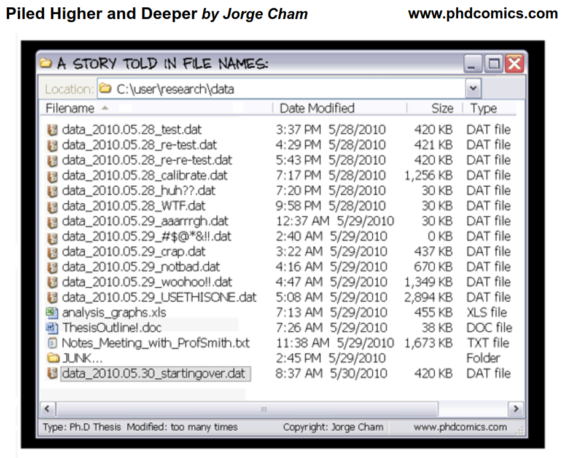
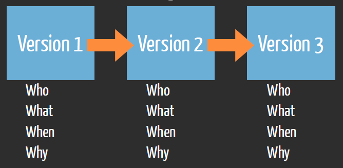
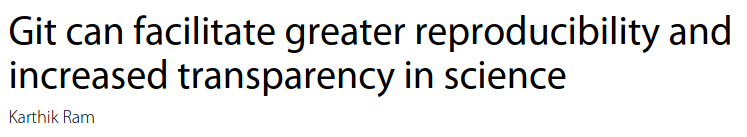
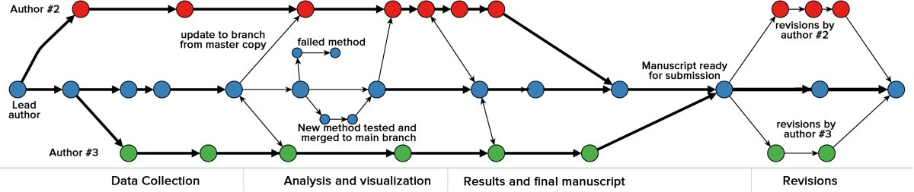
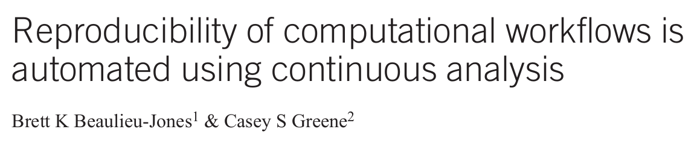
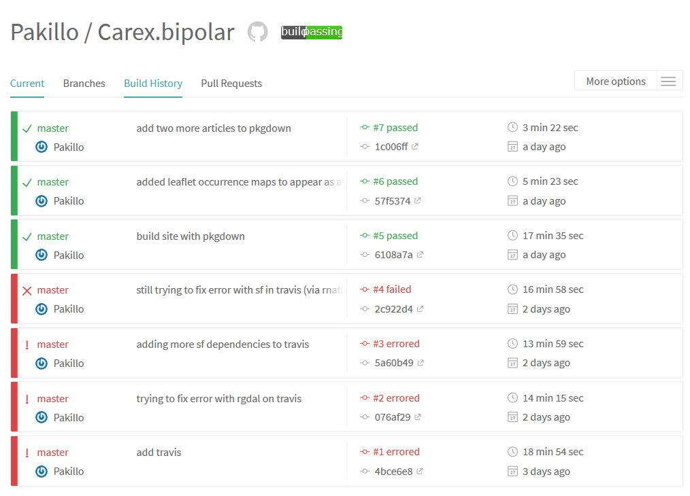
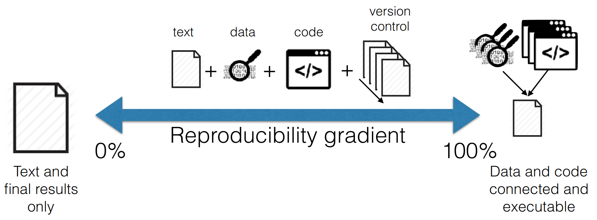

```{r include=FALSE, cache=FALSE}

options(knitr.duplicate.label = "allow")

library("knitr")

### Chunk options ###

## Text results
# opts_chunk$set(eval = TRUE, warning = FALSE, message = FALSE, size = 'tiny')
# 
# opts_template$set(fig = list(echo = FALSE, eval = TRUE))
# 
# ## Code decoration
# opts_chunk$set(tidy = FALSE, comment = NA, highlight = TRUE, prompt = FALSE, crop = TRUE)

# ## Cache
# opts_chunk$set(cache = TRUE, cache.path = "knitr_output/cache/")

# ## Plots
# opts_chunk$set(fig.path = "knitr_output/figures/")
# opts_chunk$set(fig.align = 'center', out.width = '80%')

### Hooks ###
## Crop plot margins
knit_hooks$set(crop = hook_pdfcrop)

## Reduce font size
## use tinycode = TRUE as chunk option to reduce code font size
# see http://stackoverflow.com/a/39961605
knit_hooks$set(tinycode = function(before, options, envir) {
  if (before) return(paste0("\n \\", options$size, "\n\n"))
  else return("\n\n \\normalsize \n")
  })

```


# The Reproducibility ~~Crisis~~ Revolution

```{r child="repro_crisis.Rmd"}
```


# Why doing reproducible research?

```{r child="why_repro.Rmd"}
```


# How to do reproducible research


```{r child="reproducibility_basic.Rmd"}
```


# Version control

---

```{r }

```


## Version control with `git`

```{r out.width = '3.5in', out.height = '1.7in'}

```

\raggedright
\tiny [R. Fitzjohn](https://github.com/richfitz/reproducibility-2014)
\raggedleft


## Much to learn from software engineering

```{r out.width="60%", fig.align='left'}

```

```{r out.width="90%"}

```

\raggedright
\tiny [Ram 2013](https://doi.org/10.1186/1751-0473-8-7)
\raggedleft


## Automatic checks with Continuous Integration

```{r out.width="50%", fig.align='left'}

```

```{r out.width = '3.5in', out.height = '2.7in'}

```


# Structuring projects

```{r child="project_structure.Rmd"}
```


# Research compendia: projects as packages

```{r child="research_compendia.Rmd", eval=TRUE}
```


# Data management

```{r child="data_management.Rmd", eval=TRUE}
```


# Tidy data

```{r child="tidy_data.Rmd", eval=TRUE}
```


# Reproducible dynamic documents with Rmarkdown

```{r child="Rmarkdown.Rmd", eval=TRUE}
# Rmarkdown.Rmd now hosted at independent repo: "Rmarkdown_workshop"
```


# Workflow management

```{r child="workflow-management.Rmd", eval=TRUE}
```


# Controlling software dependencies

```{r child="dependencies.Rmd", eval=TRUE}
```


## How to write more reproducible code

- [BES guide to reproducible code](https://www.britishecologicalsociety.org/wp-content/uploads/2019/06/BES-Guide-Reproducible-Code-2019.pdf)

- [Turing Way](https://the-turing-way.netlify.app)

- [Good enough practices in scientific computing](https://doi.org/10.1371/journal.pcbi.1005510)

- [Ciencia reproducible: qué, por qué, cómo](https://doi.org/10.7818/ECOS.2016.25-2.11)

- https://rstats.wtf

- [`fertile`](https://github.com/baumer-lab/fertile) package

- [CodeCheck](https://codecheck.org.uk)


## Reproducibility

- Good for you, good for science

- Requires systemic changes

- Reproducibility gradient: step by step

```{r out.width = '80%', echo=FALSE, eval=TRUE}

```


---

\LARGE
Happy collaboration!

\vspace{2cm}

```{r out.width="20%", echo=F, eval=T}

```

