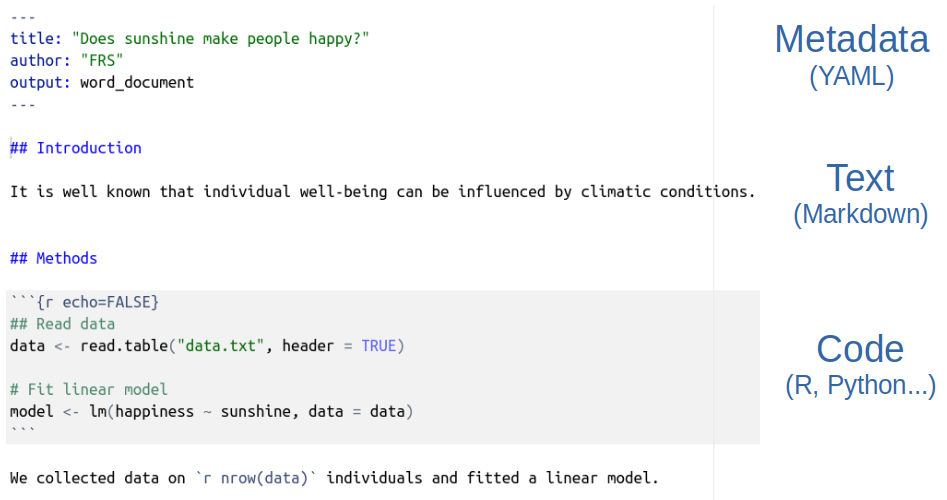
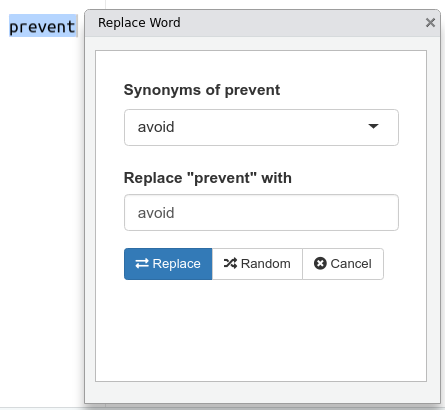

```{r setup, include=FALSE, cache=FALSE}

library('knitr')

### Chunk options ###

## Text results
opts_chunk$set(echo = TRUE, eval = FALSE, warning = FALSE, message = FALSE, size = 'tiny')

opts_template$set(fig = list(echo = FALSE, eval = TRUE))

## Code decoration
opts_chunk$set(tidy = FALSE, comment = NA, highlight = TRUE, prompt = FALSE, crop = TRUE)

# ## Cache
# opts_chunk$set(cache = TRUE, cache.path = 'knitr_output/cache/')

# ## Plots
# opts_chunk$set(fig.path = 'knitr_output/figures/')
opts_chunk$set(fig.align = 'center', out.width = '80%')

### Hooks ###
## Crop plot margins
knit_hooks$set(crop = hook_pdfcrop)

## Reduce font size
## use tinycode = TRUE as chunk option to reduce code font size
# see http://stackoverflow.com/a/39961605
knit_hooks$set(tinycode = function(before, options, envir) {
  if (before) return(paste0('\n \\', options$size, '\n\n'))
  else return('\n\n \\normalsize \n')
  })

```

## A scary movie... with happy ending


<https://youtu.be/s3JldKoA0zw>

## A typical research workflow

::: {.columns align='center' totalwidth='8em'}
::: {.column width='70%'}
\Large

1.  Prepare data (**spreadsheet**)

2.  Analyse data (**R**)

3.  Write report/paper (**Word**)

4.  Start the email attachments nightmare...
:::

::: {.column width='30%'}
```{r opts.label = 'fig', out.width='95%'}

```
:::
:::

## This workflow is broken

```{r opts.label = 'fig'}
include_graphics('images/workflow.png')
```

## Problems of a broken workflow

- **How did you do this?** What analysis is behind this figure? Did you account for ...?

- **What dataset was used?** Which individuals were left out? Where is the clean dataset?

- Oops, there is an error in the data. **Can you repeat the analysis?** And update figures/tables in Word!


## Manual copy-paste is tedious & problematic

```{r opts.label = 'fig'}
#
include_graphics('images/copy-paste.png')
```

\vspace{1cm}

'Transcribing numbers **from stats software by hand** was the largest source of errors'

\tiny ([Eubank 2016](https://doi.org/10.1017/S1049096516000196))

------------------------------------------------------------------------

```{r opts.label = 'fig'}
include_graphics('images/trevor_tweet.png')
```

------------------------------------------------------------------------

\Large

Your **closest collaborator** is you 6 months ago,

and you don't respond to emails.

\tiny (P. Wilson)

\vspace{1.5cm}

\Large

Even **you** will struggle to reproduce

**your own results** from a few weeks/months ago.

------------------------------------------------------------------------

\Large

Writing reproducible manuscripts is hard

Revising non-reproducible manuscripts is even harder

.

{width='300'}

## Dynamic reports

```{r opts.label = 'fig'}
include_graphics('images/integrated_workflow.png')
```

## Rmarkdown documents

-   **Fully reproducible** (trace all results inc. tables and plots)

-   **Dynamic** (regenerate with 1 click)

-   **Multiple outputs**:

    -   documents (HTML, Word, PDF)
    -   presentations (HTML, PDF, PowerPoint)
    -   books
    -   websites...

```{r opts.label = 'fig', out.width='40%'}
include_graphics('images/rmarkdown.png')
```

## Where does this value come from?

```{r opts.label = 'fig', out.width='100%'}

```

## Dynamic documents with Rmarkdown

```{r echo=FALSE, eval = TRUE}
surv.diff <- 30
```

*Rmarkdown*:

 \hspace{5mm} Survival in population A was `` `r inline_expr('surv.diff')` `` % higher

\vspace{6mm}

*Output*:

 \hspace{5mm} Survival in population A was **`r surv.diff`** % higher

## Dynamic documents with Rmarkdown

```{r echo=FALSE}
x = runif(86)
y = rnorm(86, 0.3 + 1.1*x, 0.1)
datos <- data.frame(x, y)
```

```{r eval=TRUE}
mydata <- read.csv('data.txt')
```

*Rmarkdown:*

 \hspace{5mm} We measured `` `r inline_expr('nrow(mydata)')` `` individuals

\vspace{5mm}

*Output:*

 \hspace{5mm} We measured **`r nrow(mydata)`** individuals

\vspace{1cm}

\hrulefill

> Much better than copy-paste!

## Rmarkdown: code (R, Python, etc) + text (Markdown)

```{r opts.label = 'fig', out.width='100%'}

```

## Code chunk options

    ```{r echo=FALSE, eval=TRUE, fig.height=3} `r ''`
    plot(iris)
    ```

<https://yihui.org/knitr/options/>

## Code chunk options

    ```{r} `r ''`
    #| echo = FALSE
    #| eval = TRUE
    #| fig.cap = 'My figure caption'
    
    plot(iris)
    ```

## Naming chunks helps debugging


## Naming chunks helps navigating long docs


## Naming chunks: figure files take chunk name

{width='180'}

## ¡Not only R! Python, Julia, C++, SQL, Stan, etc

`knitr` engines:

\scriptsize

```{r eval=T, echo=F, warning=FALSE}
sort(names(knitr::knit_engines$get()))
```

## Markdown: easy text formatting

`# Header`

`## Subheader`

`*italic*`

`**bold**`

`[a link](https://example.com)`

.

Handy: <https://thinkr-open.github.io/remedy/>

Or use [Visual Markdown Editor](https://rstudio.github.io/visual-markdown-editing/)

## Regenerate Word/PDF/HTML with one click

```{r opts.label = 'fig', out.width='100%'}
include_graphics('images/Fig3.png')
```

------------------------------------------------------------------------

## Spotted error in the data? No problem!

\Large

-   Make changes in Rmarkdown document

-   Click `Knit` in Rstudio

-   Report will **update automatically!**

## Why Rmarkdown?

```{r opts.label = 'fig'}

```

<https://community.rstudio.com/t/convince-me-to-start-using-r-markdown/1636/12>

# Your turn

## Create, edit and share Rmarkdown document

File \> New File \> Rmarkdown

Write text

Insert code chunks

Change chunk options (echo, eval, etc)

HTML/Word/PDF output

\vspace{1.5cm}

**PDF generation requires LaTeX**

```{r eval=FALSE}
library('tinytex')

install_tinytex()
```

# Rmarkdown bells and whistles

## 'Visual Rmarkdown': Rmd as in word processor

```{r opts.label = 'fig'}

```

<https://rstudio.github.io/visual-markdown-editing>

## Automatic table generation

```{r echo=FALSE, eval=TRUE}
library(xtable)
#model <- lm(y ~ x, data = datos)
mydata <- read.table('data.txt', header = TRUE)
model <- lm(happiness ~ sunshine, data = mydata)
```

```{r}
model <- lm(happiness ~ sunshine, data = mydata)
xtable(model)
```

```{r echo=FALSE, eval=TRUE, results = 'asis'}
print(xtable(model), comment = FALSE)
```

\vspace{1cm}

Many alternatives: `gtsummary`, `modelsummary`, `huxtable`, etc

## `equatiomatic` describes model structure

We fitted a linear model:

```{r eval=T, results='asis'}
library('equatiomatic')
model <- lm(happiness ~ sunshine, data = mydata)
extract_eq(model)
```

## Models that describe themselves!

\scriptsize

```{r eval=T, results='asis'}
library('report')
model <- lm(happiness ~ sunshine, data = mydata)
report(model)
```

## Insert equations with LaTeX

Using LaTeX:

    $$
    y \sim N(\mu, \sigma^2)
    $$

$$
y \sim N(\mu, \sigma^2)
$$

-   Mathpix: <https://github.com/jonocarroll/mathpix>

## Citing bibliography

```{r opts.label = 'fig'}

```

\footnotesize <https://rstudio.github.io/visual-markdown-editing/#/citations>

## Using BibTeX file with references

```{r opts.label = 'fig', out.width='60%'}

```

## Format bibliography for any journal

```{r opts.label = 'fig'}
include_graphics('images/csl.png')
```

Thousands of Citation Styles:

\scriptsize <https://www.zotero.org/styles>

\scriptsize <https://github.com/citation-style-language/styles>

## Rmarkdown templates

::: {.columns align='center' totalwidth='8em'}
::: {.column width='50%'}
-   rticles

-   papaja

-   rrtools

-   pinp

-   rmdTemplates

-   pagedreport

-   GitHub!
:::

::: {.column width='50%'}
```{r opts.label = 'fig', out.width='95%'}

```
:::
:::

## Accessing Rmd templates

```{r opts.label = 'fig'}

```

## Revise writing style: gramr


<https://github.com/ropenscilabs/gramr>

<https://github.com/nevrome/wellspell.addin>

## Find synonyms



<https://github.com/gadenbuie/synamyn>

## Word count and readability


<https://github.com/benmarwick/wordcountaddin>

## Automated reproducibility checks

<https://github.com/brandmaier/reproducibleRchunks>

```{r opts.label = 'fig', out.width='40%', fig.align='left'}
include_graphics('images/reproducibleR.png')
```

```{r opts.label = 'fig', out.width='60%'}

```

```{r opts.label = 'fig', out.width='60%'}

```


## Write books, theses, with `bookdown`

```{r opts.label = 'fig', out.width='95%'}

```

<https://bookdown.org/>

## Slide presentations with `xaringan`

```{r opts.label = 'fig'}

```

<https://slides.yihui.org/xaringan/>

## Parameterised reports

```{r opts.label = 'fig', out.width='50%'}

```

\tiny <https://bookdown.org/yihui/rmarkdown/parameterized-reports.html>

## Render thousands of individual reports from Rmd template

```{r}
library('rmarkdown')

for (i in unique(penguins$species)) {
  
  render('template_report.Rmd', 
         params = list(sp = i))
  
}
```

## Collaborative writing

-   GitHub, GitLab, etc

-   Google Docs ([trackdown](https://claudiozandonella.github.io/trackdown/))

-   [redoc](https://noamross.github.io/redoc/)

{height='900 px'}

# Rmarkdown resources

## Rmarkdown website

<http://rmarkdown.rstudio.com/>

```{r opts.label = 'fig'}
include_graphics('images/rmdrstudio.PNG')
```

## Rmarkdown cheat sheet

```{r opts.label = 'fig'}
include_graphics('images/rmarkdown-cheatsheet.png')
```

<https://www.rstudio.org/links/r_markdown_cheat_sheet>

## Rmarkdown reference guide

```{r opts.label = 'fig', out.width='60%'}
include_graphics('images/rmarkdown-reference.png')
```

\scriptsize <https://github.com/rstudio/cheatsheets/blob/main/old/pdfs/rmarkdown-reference.pdf>

## Rmarkdown books

```{r opts.label = 'fig', out.width='60%'}

```

<https://bookdown.org/yihui/rmarkdown/>

<https://bookdown.org/yihui/rmarkdown-cookbook/>


# Quarto


## Quarto: 2nd generation Rmarkdown


<https://quarto.org/>

## Quarto manuscripts

```{r opts.label = 'fig', out.width='80%'}

```

\scriptsize

<https://quarto-ext.github.io/manuscript-template-jupyter/>

<https://quarto.org/docs/manuscripts/>


## Hundreds of Quarto extensions

<https://m.canouil.dev/quarto-extensions/>

Journal templates: 

<https://quarto.org/docs/extensions/listing-journals.html>

# Your turn

## Your turn

\Large

- Try visual markdown editor

- Add bibliography

- Try templates (rticles, rmdTemplates)

- Parameterised reports (e.g. different iris or penguin species)

- Quarto manuscript
