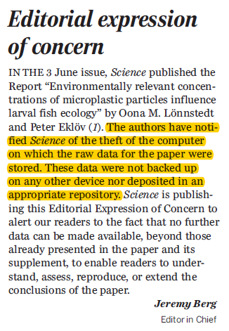

```{r include=FALSE, cache=FALSE}

library('knitr')

### Chunk options ###

## Text results
opts_chunk$set(echo = FALSE, eval = TRUE, warning = FALSE, message = FALSE, size = 'tiny')

opts_template$set(fig = list(echo = FALSE, eval = TRUE))

## Code decoration
opts_chunk$set(tidy = FALSE, comment = NA, highlight = TRUE, prompt = FALSE, crop = TRUE)

# ## Cache
# opts_chunk$set(cache = TRUE, cache.path = 'knitr_output/cache/')

# ## Plots
# opts_chunk$set(fig.path = 'knitr_output/figures/')
opts_chunk$set(fig.align = 'center', out.width = '80%')

### Hooks ###
## Crop plot margins
knit_hooks$set(crop = hook_pdfcrop)

## Reduce font size
## use tinycode = TRUE as chunk option to reduce code font size
# see http://stackoverflow.com/a/39961605
knit_hooks$set(tinycode = function(before, options, envir) {
  if (before) return(paste0('\n \\', options$size, '\n\n'))
  else return('\n\n \\normalsize \n')
  })

```


## Data management

See https://dataoneorg.github.io/Education/bestpractices/

.

1. [Planification](https://doi.org/10.1371/journal.pcbi.1004525) (e.g. [DMPTool](https://dmptool.org/))

2. Collection

3. Metadata [description](https://dataoneorg.github.io/Education/bp_step/describe/) ([dataspice](https://docs.ropensci.org/dataspice/), [EML](https://docs.ropensci.org/EML), [Data Packages](http://frictionlessdata.io/), [DataPackageR](https://docs.ropensci.org/DataPackageR/))

4. Quality control (e.g. [assertr](https://github.com/ropensci/assertr), [validate](https://github.com/data-cleaning/validate),
[pointblank](https://github.com/rich-iannone/pointblank))

5. [Storage](https://doi.org/10.1371/journal.pcbi.1005097)


## Document your data

\footnotesize

```{r echo=TRUE, eval=FALSE}
library('dataspice')
create_spice()   # create CSV templates for metadata

edit_creators()  # open Shiny apps to edit the CSVs
prep_access()
edit_access()
prep_attributes()
edit_attributes()
edit_biblio()

write_spice()  # write machine-readable metadata

build_site()  # build human-readable metadata report
```

https://docs.ropensci.org/dataspice/


## Check data before analysis

```{r echo=TRUE, eval=FALSE}
library('assertr')

dataset %>% 
  assert(within_bounds(0, 0.20), fruit.weight) %>% 
  assert(in_set('black', 'red'), colour)
```

Check out also [`pointblank`](https://rich-iannone.github.io/pointblank/index.html)


## Storage

```{r out.width='50%'}

```

\scriptsize
http://science.sciencemag.org/content/354/6317/1242.1
\normalsize


## Storage

Use the **cloud**: safe, persistent, easy to share

- [Open Science Framework](https://osf.io/)

- GitHub

- Dropbox

- Figshare, Zenodo, etc

- See all data repositories in www.re3data.org


