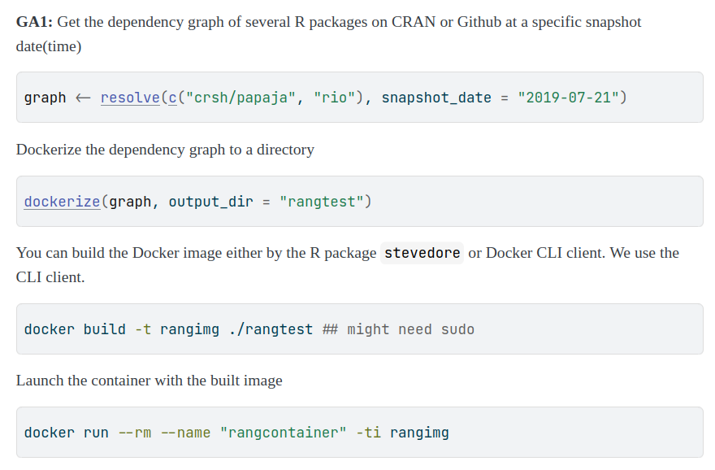
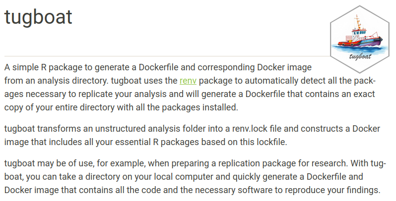
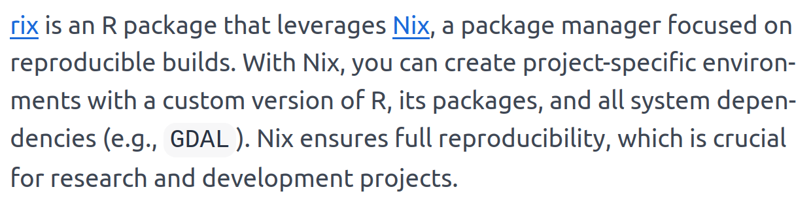
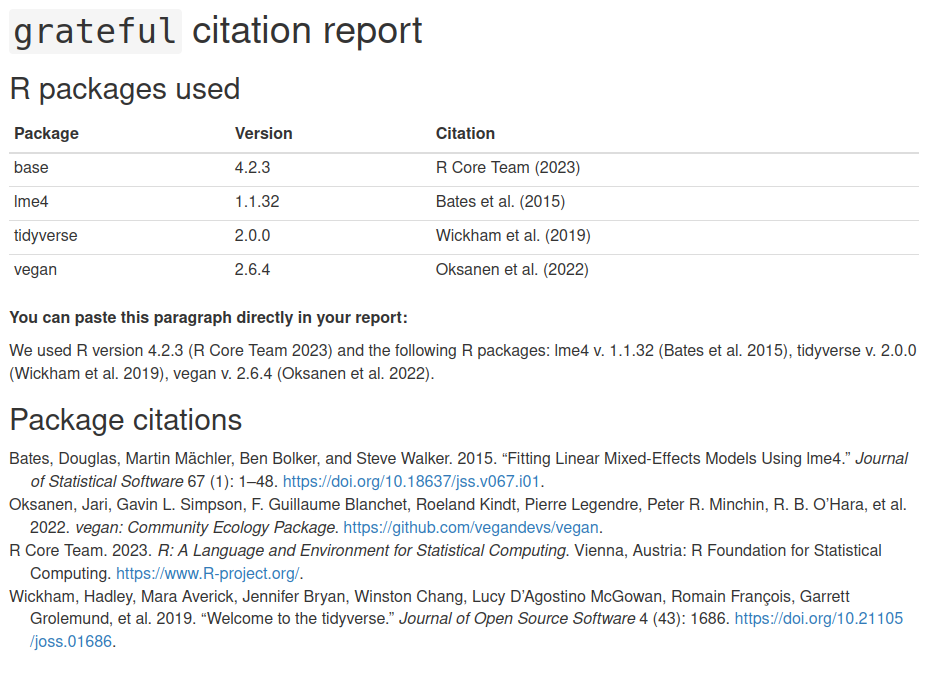

```{r include=FALSE, cache=FALSE}

library('knitr')

### Chunk options ###

## Text results
opts_chunk$set(echo = TRUE, eval = FALSE, warning = FALSE, message = FALSE, size = 'tiny')

opts_template$set(fig = list(echo = FALSE, eval = TRUE))

## Code decoration
opts_chunk$set(tidy = FALSE, comment = NA, highlight = TRUE, prompt = FALSE, crop = TRUE)

# ## Cache
# opts_chunk$set(cache = TRUE, cache.path = 'knitr_output/cache/')

# ## Plots
# opts_chunk$set(fig.path = 'knitr_output/figures/')
opts_chunk$set(fig.align = 'center', out.width = '80%')

### Hooks ###
## Crop plot margins
knit_hooks$set(crop = hook_pdfcrop)

## Reduce font size
## use tinycode = TRUE as chunk option to reduce code font size
# see http://stackoverflow.com/a/39961605
knit_hooks$set(tinycode = function(before, options, envir) {
  if (before) return(paste0('\n \\', options$size, '\n\n'))
  else return('\n\n \\normalsize \n')
  })

```


---

```{r opts.label='fig', out.width='70%'}
include_graphics('images/sotobosque.png')
```


---

\Large

Updating R packages broke your script?

Need to run an old script from you, or someone else?

How to reproduce your analysis in a year, \newline or different computer?


## `sessionInfo` records OS & used packages

\tiny

```{r eval=T}
sessionInfo()
```


## `checkpoint` recreates R packages in given date

\footnotesize

```{r }
library('checkpoint')

options(checkpoint.mranUrl="https://packagemanager.posit.co/")

checkpoint('2024-10-08')

source('analysis.R')
```

\normalsize

1. Detects packages used

2. Installs version from given date (only CRAN)

3. Independent install (not messing w/ main library)


## `automagic` records & install packages (CRAN + GitHub)

\scriptsize

```{r }
automagic::make_deps_file()
```

File `deps.yaml` records dependencies:
\tiny
```yaml
- Package: equatiomatic
  Repository: CRAN
  Version: 0.1.0
  
- Package: report
  GithubUsername: easystats
  GithubRepo: report
  GithubRef: HEAD
  GithubSHA1: c48a4bb0a40df7116bc502aa3ce2cbbc9d70b7e2
```
\scriptsize

To install all those dependencies:

```{r eval=FALSE, echo=TRUE}
automagic()
```


## `groundhog` loads packages as available on given date

https://groundhogr.com/

```{r eval=FALSE, echo=TRUE}
library('groundhog')

groundhog.library(pkg = c('dplyr', 'ggplot2'), 
                  date = "2024-09-01")
```


## `renv`: recommended way to control dependencies

```{r }
renv::init()  
# Create private package library for project

renv::snapshot()   
# Capture dependencies in lockfile

renv::restore()  
# Regenerate dependencies from lockfile
```

https://rstudio.github.io/renv/


---

\Large

To ensure reproducibility,

besides R packages

we also need to control 

**computational environment**


---

\large

`Docker` recreates virtual systems

from a `Dockerfile` 


## `rang` recreates environment (pkgs + external software)

https://gesistsa.github.io/rang/

```{r opts.label='fig', out.width='90%'}

```


## `liftr`: process Rmd in Docker container

```{r opts.label='fig', out.width='95%'}
include_graphics('images/liftr.png')
```

\footnotesize https://liftr.me/


## `containerit` creates Dockerfile

```{r }
library('containerit')

dockfile <- dockerfile(from = 'mypaper.Rmd')
```

\footnotesize https://o2r.info/containerit


## `tugboat` creates Dockerfile w/ entire software environment

```{r opts.label = 'fig'}

```

```{r echo=TRUE, eval=FALSE}
library(tugboat)
create()
build()
```

https://www.dmolitor.com/tugboat/


::: hide :::

## `holepunch`: reproduce analysis in the cloud (Binder)

```{r opts.label = 'fig'}
include_graphics('images/holepunch.png')
```

\footnotesize https://karthik.github.io/holepunch/

:::


## `rix`: reproducible environments with Nix

https://docs.ropensci.org/rix/

```{r opts.label = 'fig'}

```


## Remember to cite software used!

https://pakillo.github.io/grateful/

```{r}
library('grateful')
cite_packages()
```

```{r opts.label = 'fig'}

```


# Your turn

---

\Large

- Create script/Rmd using different packages

- Call `checkpoint` on former date

- Record dependencies:
  - `renv::snapshot`

- Recreate packages
  - `restore()`
    
    
