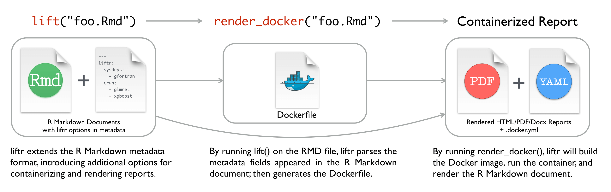

```{r include=FALSE, cache=FALSE}

library("knitr")

### Chunk options ###

## Text results
opts_chunk$set(echo = TRUE, eval = FALSE, warning = FALSE, message = FALSE, size = 'tiny')

opts_template$set(fig = list(echo = FALSE, eval = TRUE))

## Code decoration
opts_chunk$set(tidy = FALSE, comment = NA, highlight = TRUE, prompt = FALSE, crop = TRUE)

# ## Cache
# opts_chunk$set(cache = TRUE, cache.path = "knitr_output/cache/")

# ## Plots
# opts_chunk$set(fig.path = "knitr_output/figures/")
opts_chunk$set(fig.align = 'center', out.width = '80%')

### Hooks ###
## Crop plot margins
knit_hooks$set(crop = hook_pdfcrop)

## Reduce font size
## use tinycode = TRUE as chunk option to reduce code font size
# see http://stackoverflow.com/a/39961605
knit_hooks$set(tinycode = function(before, options, envir) {
  if (before) return(paste0("\n \\", options$size, "\n\n"))
  else return("\n\n \\normalsize \n")
  })

```


---

```{r opts.label="fig", out.width="70%"}

```


---

\Large

Package changes can break your analysis

How to reproduce your analysis in a year, \newline or different computer?


## `sessionInfo` records OS & used packages

\tiny

```{r eval=T}
sessionInfo()
```

\normalsize


## `checkpoint` reconstructs packages in given date

```{r }
library('checkpoint')

checkpoint("2019-10-08")

source("analysis.R")
```

1. Detects packages used

2. Installs version from given date (only CRAN)

3. Independent install (not messing w/ main library)


## `automagic` records & install packages (CRAN + GitHub)

\scriptsize

```{r }
automagic::make_deps_file()
```

File `deps.yaml` records dependencies:
\tiny
```yaml
- Package: equatiomatic
  Repository: CRAN
  Version: 0.1.0
  
- Package: report
  GithubUsername: easystats
  GithubRepo: report
  GithubRef: HEAD
  GithubSHA1: c48a4bb0a40df7116bc502aa3ce2cbbc9d70b7e2
```
\scriptsize
To install all those dependencies:
```{r eval=FALSE, echo=TRUE}
automagic()
```

\normalsize


## `renv` also controls dependencies

```{r }
renv::init()  
# Create private package library for project

renv::snapshot()   
# Capture dependencies in lockfile

renv::restore()  
# Regenerate dependencies from lockfile
```

https://environments.rstudio.com/


---

\Large

To ensure reproducibility,

besides R packages

we also need to control 

**computational environment**


---

\large

`Docker` recreates virtual systems

from a `Dockerfile` 

\normalsize


## `liftr`: process Rmd in Docker container

```{r opts.label="fig", out.width="95%"}

```

\footnotesize https://liftr.me/


## `containerit` creates Dockerfile

```{r }
library("containerit")

dockfile <- dockerfile(from = "mypaper.Rmd")
```

\footnotesize https://o2r.info/containerit


## `holepunch`: reproduce analysis in the cloud (Binder)

```{r opts.label = "fig"}
include_graphics("images/holepunch.png")
```

\footnotesize https://karthik.github.io/holepunch/


# Your turn

## Checkpoint

\Large

- Create script/Rmd using different packages

- Call `checkpoint` on former date


## automagic/renv

\Large

- Record dependencies:
    - `automagic::make_deps_file()` 
    - `renv::snapshot`

- Recreate packages
    - `automagic()`
    - `restore()`
    
    
