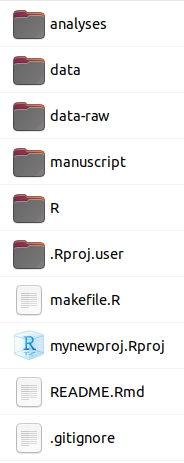

```{r include=FALSE, cache=FALSE}

library("knitr")

### Chunk options ###

## Text results
opts_chunk$set(echo = TRUE, eval = FALSE, warning = FALSE, message = FALSE, size = 'tiny')

opts_template$set(fig = list(echo = FALSE, eval = TRUE))

## Code decoration
opts_chunk$set(tidy = FALSE, comment = NA, highlight = TRUE, prompt = FALSE, crop = TRUE)

# ## Cache
# opts_chunk$set(cache = TRUE, cache.path = "knitr_output/cache/")

# ## Plots
# opts_chunk$set(fig.path = "knitr_output/figures/")
opts_chunk$set(fig.align = 'center', out.width = '80%')

### Hooks ###
## Crop plot margins
knit_hooks$set(crop = hook_pdfcrop)

## Reduce font size
## use tinycode = TRUE as chunk option to reduce code font size
# see http://stackoverflow.com/a/39961605
knit_hooks$set(tinycode = function(before, options, envir) {
  if (before) return(paste0("\n \\", options$size, "\n\n"))
  else return("\n\n \\normalsize \n")
  })

```


## One Project = One Folder

```
myproject
  |
  |- data
  |
  |- code
  |
  |- output (figures etc)
  |
  |- manuscript
```


## Project-Oriented Workflow: advantages

\LARGE

- Self-contained

- Easy to navigate (file paths)

- Easy to share

\normalsize


## Rstudio projects

```{r opts.label = 'fig'}
include_graphics("images/projects_new.png")
```


## Avoid saving workspace

```{r opts.label = 'fig', out.width="70%"}
include_graphics("images/rstudio-workspace.png")
```

\footnotesize https://rstats.wtf

::: hide :::
## Use `here` for file paths

```{r }
setwd('C:/Users/PACO/myproject')

mydata <- read.csv('data/mydata.csv')
```

. . . 

```{r }
library('here')

mydata <- here('data', 'mydata.csv')
```
:::


## Use `here` for file paths

```{r opts.label = 'fig'}

```


## `fertile` package: real-time feedback on reproducibility

```{r }
library('fertile')

setwd("C:/Users/FRS")
```

*Error: setwd() is likely to break reproducibility. Use here::here() instead.*

\vspace{5mm}

\scriptsize https://github.com/baumer-lab/fertile


# Structuring projects: guidelines

## Guidelines for structuring projects

\large

::: incremental

- All files in **same directory**

- **Raw data** separate from **clean data**

- **Modular code** (functions)

- **Output disposable & separate** from code

- `makefile` runs analyses in **appropriate order**

- **Software dependencies** under control

- README 

- License

\normalsize
:::


\tiny
[Noble 2009](https://doi.org/10.1371/journal.pcbi.1000424), [Rodriguez-Sanchez et al 2016](https://www.revistaecosistemas.net/index.php/ecosistemas/article/view/1178), [Wilson et al 2017]( https://doi.org/10.1371/journal.pcbi.1005510) 
\normalsize


## Project organisation example

```
- data
  - data-raw       
  - data-clean

- code

- output (figures etc)

- manuscript

- README
- License
- Makefile
```


## README file

:::::::::::::: {.columns align=center totalwidth=8em}
::: {.column width="20%" align=center}
- What

- Who

- How

- Licence

- Citation

- etc
:::
::: {.column width="80%" align=center}
```{r out.width='3in', out.height='2.6in', echo=FALSE, eval=TRUE}

```
:::
::::::::::::::


## Document your data

\footnotesize

```{r echo=TRUE, eval=FALSE}
library("dataspice")
create_spice()   # create CSV templates for metadata

edit_creators()  # open Shiny apps to edit the CSVs
prep_access()
edit_access()
prep_attributes()
edit_attributes()
edit_biblio()

write_spice()  # write machine-readable metadata

build_site()  # build human-readable metadata report
```

\footnotesize

## Write modular code

**Break up scripts**

```{r echo=TRUE, eval=FALSE}
prepare_data.R

run_analysis.R

make_figures.R
```

(and `makefile` will run them in the right order)


## `makefile` runs code in appropriate order

`makefile.R`

```{r echo=TRUE, eval=FALSE}
source("prepare_data.R")

source("run_analysis.R")

source("make_figures.R")
```


## Don't Repeat Yourself (DRY)

```{r echo=TRUE, eval=FALSE}
dataset |> 
  filter(species == "Laurus nobilis") |> 
  ggplot() +
  geom_point(aes(x, y))

dataset |> 
  filter(species == "Laurus azorica") |> 
  ggplot() +
  geom_point(aes(x, y))
```


## Don't Repeat Yourself

**Write functions** (documented + tested)

```{r echo=TRUE, eval=FALSE}
plot_species <- function(sp, data) {
  data |> 
    filter(species == sp) |> 
    ggplot() +
    geom_point(aes(x, y))
}
```


## Don't Repeat Yourself

**Use functions**

```{r echo=TRUE, eval=FALSE}
plot_species(sp = "Laurus nobilis", dataset)

plot_species(sp = "Laurus azorica", dataset)
```

## Don't Repeat Yourself

**Use for loops**

```{r echo=TRUE, eval=FALSE}
for (i in species) {
  plot_species(sp = i, dataset)
}
```


## Don't Repeat Yourself

**Good ol' `lapply`**

```{r echo=TRUE, eval=FALSE}
lapply(species, plot_species, data = dataset)
```


## Don't Repeat Yourself

```{r echo=TRUE, eval=FALSE}
library("purrr")

map(species, plot_species, data = dataset)
```


## Comment your code

**Why** rather than **What**

```{r echo=TRUE, eval=FALSE}
## Response is not linear, so fit gam rather than lm

model.height <- gam(height ~ s(diameter), data = trees)
```


## Use meaningful names for objects

```{r echo=TRUE, eval=FALSE}
m1 <- lm(height ~ diameter, data = trees)
m2 <- gam(height ~ s(diameter), data = trees)
```

. . . 

```{r echo=TRUE, eval=FALSE}
model.linear <- lm(height ~ diameter, data = trees)
model.gam <- gam(height ~ s(diameter), data = trees)
```


# Project templates

## Automatic project creation with `template`

:::::::::::::: {.columns align=center totalwidth=8em}
::: {.column width="70%" align=bottom}
```{r }
library('template')
```

```{r }
new_project("mynewproj", 
            package = FALSE)
```
:::
::: {.column width="30%"}
```{r opts.label = 'fig'}

```
:::
::::::::::::::


## `template`: New projects also on GitHub

```{r }
new_project("mynewproj", 
            package = FALSE,
            github = TRUE)
```

```{r opts.label = 'fig', out.width='90%'}
include_graphics("images/template-github.png")
```


# \includegraphics[height=2cm]{images/workflowr-logo.png} \newline \newline `workflowr`: \newline reproducible projects with website 


## `wflow_start` creates project scaffolding

:::::::::::::: {.columns align=center totalwidth=8em}
::: {.column width="70%" align=bottom}
```{r }
library('workflowr')

wflow_start("newproject")
```
:::
::: {.column width="30%"}
```{r opts.label = 'fig'}

```
:::
::::::::::::::


## `wflow_open` starts new analysis

```{r }
wflow_open("analysis/first-analysis.Rmd")
```

```{r opts.label = 'fig', out.width="40%"}

```


## `wflow_build` runs analyses and generates website

```{r }
wflow_build()
```

```{r opts.label = 'fig', out.width="70%"}

```


## `wflow_publish` commits changes & updates everything

```{r }
wflow_publish(c("analysis/first-analysis.Rmd", 
                "analysis/index.Rmd", 
                "analysis/about.Rmd", 
                "analysis/license.Rmd"),
              message = "Publish initial analyses")
```

## Connect with GitHub/GitLab and deploy website

```{r }
wflow_use_github("Pakillo")

wflow_git_push()
```


