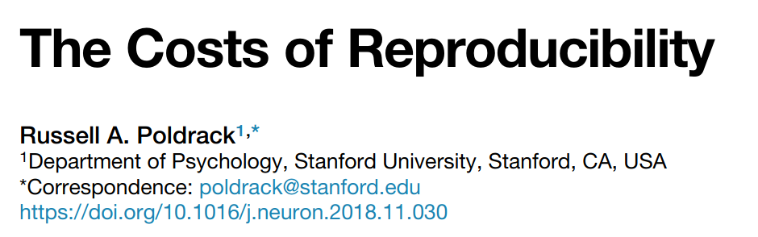

```{r setup, include=FALSE}
library('knitr')
knitr::opts_chunk$set(echo = FALSE, cache = FALSE, background = 'red',
                      out.width = '80%',
                      # out.height = '2in', 
                      fig.align = 'center')
```

---


```{r }
include_graphics('images/repro-crisis-Nature-2.png')
```

\raggedright
\tiny [Baker 2016](https://doi.org/10.1038/533452a)
\raggedleft


## The reproducibility crisis in mass media

```{r out.width='95%'}

```

\raggedright
\tiny [El País](https://elpais.com/elpais/2017/01/10/ciencia/1484073680_523691.html)
\raggedleft


## Reproducibility Project: Cancer Biology

```{r }
include_graphics('images/RPCB_Nature.png')
```

> - Goal: Replicate 193 experiments from 53 papers

> - Finally: 50 experiments from 23 papers

> - ~Half **didn't replicate** (much smaller effect sizes)

> - **No paper reported** all required data

> - **Impossible to repeat** experiments w/o contacting authors

> - 1/3 authors **didn't respond or help**


\raggedright
\tiny [Errington et al 2021](https://doi.org/10.7554/eLife.67995)
\raggedleft

---

```{r out.width='65%'}

```

```{r out.width='50%'}
include_graphics('images/unclear-methods2.png')
```


---

\large

Most scientific articles

\Huge

**are NOT reproducible**


::: hide :::

## The reproducibility crisis

```{r }
include_graphics('images/repro-crisis-Nature-2.png')
```

\raggedright
\tiny [Baker 2016](https://doi.org/10.1038/533452a)
\raggedleft

:::


---

\LARGE

Reproducibility

*crisis* ---> **REVOLUTION**


# What is reproducibility?

## Reproducibility vs Replicability 

```{r out.width = '4in', out.height = '2.2in'}
include_graphics('images/ReproducibleMatrix.jpg')
```

\raggedright 
\footnotesize [The Turing Way](https://the-turing-way.netlify.app/welcome)
\raggedleft


---

\Large

We can't guarantee that

our results are **REPLICABLE**.

\vspace{1cm}

But at least 

they should be **REPRODUCIBLE**.

\normalsize

---

\large

Most scientific articles

\huge

**are NOT reproducible**


---

```{r out.width='40%', fig.align='left'}

```

```{r}

```

---

```{r out.width='50%', fig.align='left'}

```

\large

1/2 articles: **inconsistencies** in p-values 

1/8 articles: **grossly inconsistent** p-values 

\normalsize
(affecting conclusions -> significance)


---

In ecology

\Huge

**< 20%** articles are **reproducible**


\raggedright 
\footnotesize [Culina et al 2020](https://doi.org/10.1371/journal.pbio.3000763)
\raggedleft


---

## We can't even reproduce our own work

Data/Code lost or unusable

```{r out.width='40%'}

```


---

::: hide :::
\small

You can’t reproduce if you don’t understand where a number came from. 

You can’t reproduce what you don’t remember. 

And trust me: you won’t. 

You can’t reproduce what you’ve lost. 

What if you need access to a file as it existed 1, 10, 100, or 1000 days ago?

\normalsize

\raggedright 
\footnotesize [Bond-Lamberty 2014](http://rstudio-pubs-static.s3.amazonaws.com/14911_24ffedb113f74789b709cbd694dc255c.html#/)
\raggedleft

:::


## What's a reproducible manuscript?

```{r out.width = '60%'}

```

DATA + CODE 

- analysis fully **traceable**

- results can be **regenerated**


---

A scientific article is **advertising**, not scholarship. 

The actual scholarship is the **full software environment**, 

**code and data**, that produced the result.

\raggedright 
\footnotesize [Claerbout & Karrenback 1992](https://doi.org/10.1190/1.1822162)
\raggedleft


## Reproducible article: text + data + code

```{r out.width = '3in', out.height = '1.3in'}

```

---

\Huge

Are we sharing the data?


## Are we sharing data?

```{r}

```

\raggedright
\tiny [Roche et al. 2015](https://doi.org/10.1371/journal.pbio.1002295)
\raggedleft


## Are we sharing data? 

```{r out.width='50%'}
include_graphics('images/Culina-data.png')
```

\raggedright
\tiny [Culina et al. 2020](https://doi.org/10.1371/journal.pbio.3000763)
\raggedleft


## Are we sharing data? 

\Large 
Quickly getting better

```{r out.width='40%'}

```

\raggedright
\tiny [Campbell et al. 2019](https://doi.org/10.1016/j.tree.2018.11.010)
\raggedleft

---

\Huge 

Are we sharing the code?


## Code exists but rarely shared

```{r out.width = '2in', out.height = '2.5in'}

```

\raggedright
\tiny [Culina et al. 2020](https://doi.org/10.1371/journal.pbio.3000763)
\raggedleft


::: hide :::

---

\Large
Las barreras

\huge
no son técnicas

\normalsize
:::


---

\Huge

\center WHY?


## Poor incentives

```{r out.width='90%'}

```

\raggedright
\tiny [O'Dea et al 2021](https://doi.org/10.1186/s12915-021-01006-3)
\raggedleft


## Doing reproducible research can be costly

```{r out.width='70%', fig.align='left'}

```

```{r out.width='70%'}

```


## Must value diverse contributions to reproducible research

```{r }

```

\raggedright
\tiny [Pierce et al 2019](https://doi.org/10.1038/d41586-019-01715-4)
\raggedleft


## Let's knock down psychological barriers

```{r out.width = '3in'}

```

\raggedright
\tiny [Barnes 2010](https://doi.org/10.1038/467753a)
\raggedleft

\normalsize

- Improve training

- Code review, preprints...

- Avoid shaming -> constructive critique

- Ugly code better than no code


