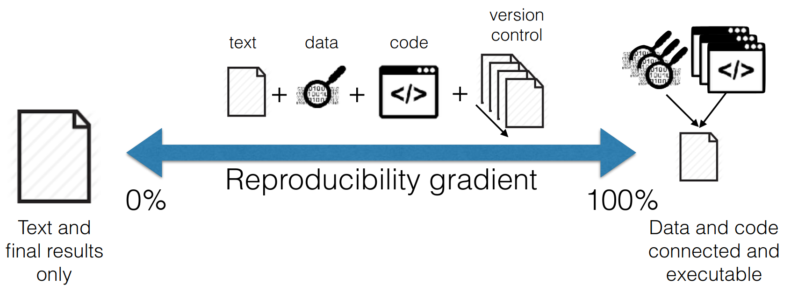

```{r setup, include=FALSE}
library("knitr")
knitr::opts_chunk$set(echo = FALSE, cache = FALSE, background = "red",
                      out.width = '80%',
                      # out.height = '2in', 
                      fig.align = 'center')
```


## Reproducibility is a gradient

```{r out.width = '4.5in', out.height = '1.7in'}

```

\raggedright
\tiny [Rodríguez-Sánchez et al. 2016](https://www.revistaecosistemas.net/index.php/ecosistemas/article/view/1178) (modif. [Peng 2011](https://doi.org/10.1126/science.1213847))
\raggedleft


# Basic reproducibility

## Basic reproducibility

- **MANUSCRIPT** (Text + Tables + Figures)

- **DATA** in permanent archive (see [Tierney & Ram 2020](https://arxiv.org/abs/2002.11626))

- **CODE** in permanent archive (see [Eglen et al 2016](https://doi.org/10.1038/nn.4550))

\vspace{10mm}

\small

*Permanent archive*: 

- Zenodo, Dryad, OSF, Figshare, Data Paper...

- NOT GitHub, website...


## How to share data

- **Open** format (csv, txt)

- **README** (who, what, when, where, why, how)

- **Describe variables** 

- **Licence** (CC0, CC-BY, ODbL)

- **Citation** (DOI)

- **Metadata** standardised (JSON, XML)

\raggedright
\tiny [Tierney & Ram 2020](https://arxiv.org/abs/2002.11626)
\raggedleft


## Document your data

```{r echo=TRUE, eval=FALSE}
library("dataspice")
create_spice()   # create CSV templates for metadata

edit_creators()  # open Shiny apps to edit the CSVs
prep_access()
edit_access()
prep_attributes()
edit_attributes()
edit_biblio()

write_spice()  # write machine-readable metadata

build_site()  # build human-readable metadata report
```


## How to share code

- Scripts: **plain text** (`.R`)

- **Permanent archive** (eg. Zenodo) with **DOI (citable)**

- [Licence](https://www.software.ac.uk/resources/guides/adopting-open-source-licence) 

- **README**

- Computational **environment** (session info)

\raggedright
\tiny [Eglen et al 2016](https://doi.org/10.1038/nn.4550)
\raggedleft


## `sessionInfo` records OS & used packages

\tiny

```{r eval=T}
sessionInfo()
```


## `renv` also records packages used

```{r eval=F}
renv::snapshot()
```


## Basic reproducibility

```{r out.width = "60%"}
include_graphics("images/text-data-code.png")
```

DATA + CODE 

- analysis fully **traceable**

- results can be **regenerated**


