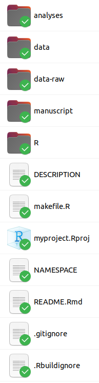
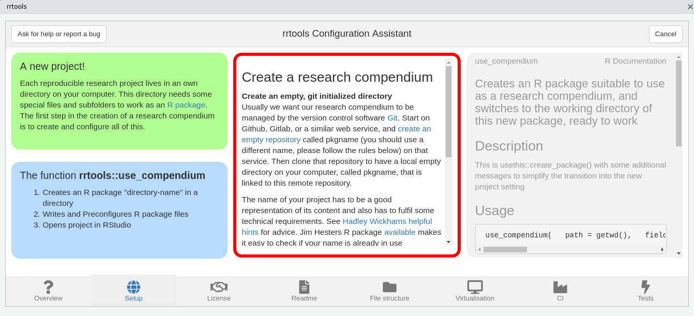
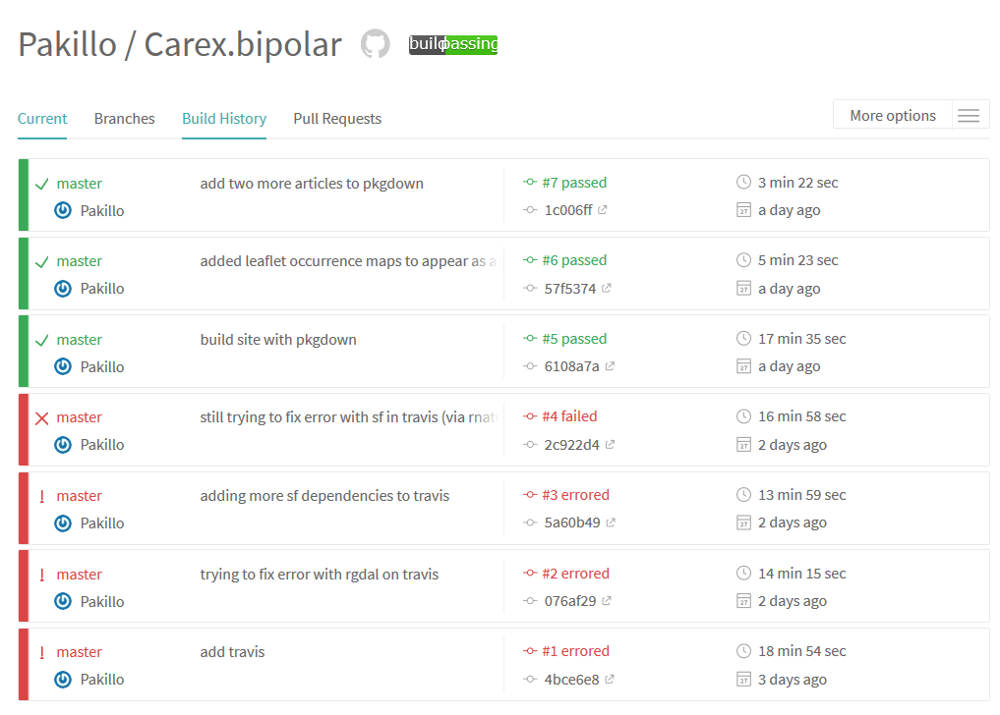

```{r include=FALSE, cache=FALSE}

library('knitr')

### Chunk options ###

## Text results
opts_chunk$set(echo = TRUE, eval = FALSE, warning = FALSE, message = FALSE, size = 'tiny')

opts_template$set(fig = list(echo = FALSE, eval = TRUE))

## Code decoration
opts_chunk$set(tidy = FALSE, comment = NA, highlight = TRUE, prompt = FALSE, crop = TRUE)

# ## Cache
# opts_chunk$set(cache = TRUE, cache.path = 'knitr_output/cache/')

# ## Plots
# opts_chunk$set(fig.path = 'knitr_output/figures/')
opts_chunk$set(fig.align = 'center', out.width = '80%')

### Hooks ###
## Crop plot margins
knit_hooks$set(crop = hook_pdfcrop)

## Reduce font size
## use tinycode = TRUE as chunk option to reduce code font size
# see http://stackoverflow.com/a/39961605
knit_hooks$set(tinycode = function(before, options, envir) {
  if (before) return(paste0('\n \\', options$size, '\n\n'))
  else return('\n\n \\normalsize \n')
  })

```


## Projects as packages

>- Standard structure

>- Promotes modular code, documented and tested

>- Easy to share and run

>- Automatic checks (Continuous Integration)

>- Automatic code review (`goodpractice`) 

>- Easily create website with `pkgdown`

\raggedright
\tiny
[Rodríguez-Sánchez et al. 2016](https://www.revistaecosistemas.net/index.php/ecosistemas/article/view/1178), [Marwick et al 2018](https://doi.org/10.1080/00031305.2017.1375986), but see [McBain 2020](https://milesmcbain.xyz/posts/an-okay-idea/)
\raggedleft


## Creating package structure with `template`

:::::::::::::: {.columns align=center totalwidth=8em}
::: {.column width='70%' align=bottom}
```{r }
library('template')
```

```{r }
new_project('myproject', 
            package = TRUE)
```
:::
::: {.column width='40%'}
```{r opts.label = 'fig', out.width='50%'}

```
:::
::::::::::::::


# rrtools

## `rrtools` creates research compendia

```{r }
library('rrtools')

use_compendium('~/myproject/') 
```

Rstudio addin: https://github.com/nevrome/rrtools.addin

```{r opts.label = 'fig'}

```


## `rrtools`: project structure

\scriptsize
```
- README
- LICENSE
- DESCRIPTION
- renv/
- Dockerfile
- analysis/
  |
  |- paper/
      |- paper.qmd       
      |- references.bib  
  |
  |- figures/            
  |
  |- data/
      |- raw_data/       
      |- derived_data/   
```
\normalsize


# \includegraphics[height=2cm]{images/rcompendium.png} \newline rcompendium

## `rcompendium` creates new project with all scaffolding

```{r}
library('rcompendium')

new_compendium()
```

- R package structure

- GitHub repository

- Automatic testing & website update


## Continuous Integration (GitHub Actions, GitLab CI...)

Automatic testing with every commit!

```{r opts.label = 'fig'}

```


## Minimalistic compendium

https://github.com/cboettig/compendium

- DESCRIPTION (dependencies)

- Manuscript (Rmd)

- GitHub Actions

