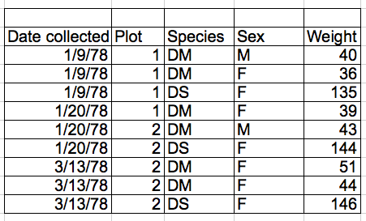

```{r include=FALSE, cache=FALSE}

library("knitr")

### Chunk options ###

## Text results
opts_chunk$set(echo = FALSE, eval = TRUE, warning = FALSE, message = FALSE, size = 'tiny')

opts_template$set(fig = list(echo = FALSE, eval = TRUE))

## Code decoration
opts_chunk$set(tidy = FALSE, comment = NA, highlight = TRUE, prompt = FALSE, crop = TRUE)

# ## Cache
# opts_chunk$set(cache = TRUE, cache.path = "knitr_output/cache/")

# ## Plots
# opts_chunk$set(fig.path = "knitr_output/figures/")
opts_chunk$set(fig.align = 'center', out.width = '90%')

### Hooks ###
## Crop plot margins
knit_hooks$set(crop = hook_pdfcrop)

## Reduce font size
## use tinycode = TRUE as chunk option to reduce code font size
# see http://stackoverflow.com/a/39961605
knit_hooks$set(tinycode = function(before, options, envir) {
  if (before) return(paste0("\n \\", options$size, "\n\n"))
  else return("\n\n \\normalsize \n")
  })

```


## Tidy data

```{r out.width='100%'}
include_graphics("images/tidydata.png")
```


```{r out.width='100%'}
include_graphics("images/gatherdata.png")
```

\scriptsize
http://r4ds.had.co.nz/tidy.html
\normalsize


## Be careful with data entry and management in Excel!

```{r}

```


## Spreadsheet good practices

\scriptsize

> - Put **variables** in **columns** (things you are measuring: height, weight, sex)

> - Each **observation** in one **row** (e.g. individuals).

> - **Avoid** spaces, numbers, and **special characters** in column names.

> - Always **write zero values**, to distinguish from blank/missing data.

> - Use blank/empty cells, or NA, for missing data.

> - Input dates as **year, month, day** in separate columns. Or **YYYY-MM-DD** as text.

> - Use **[Data validation](http://bit.ly/excel_dataval)** in Excel (or GForms) to constrain data entry to accepted values.

> - Don't combine multiple pieces of information in one cell.

> - **Don't touch raw data**. Do all data manipulation through code.

> - Export data as plain text (txt, csv).


> - http://www.datacarpentry.org/spreadsheet-ecology-lesson/

> - http://kbroman.org/dataorg/

> - Broman & Woo: [Data organization in spreadsheets](https://doi.org/10.1080/00031305.2017.1375989)

\normalsize


# Common spreadsheet errors


## More than one variable per column

:::::::::::::: {.columns align=center}

::: {.column width="40%"}
```{r out.width='2in'}
include_graphics("images/DC-multiple-info.png")
```
:::

::: {.column width="60%" }
```{r out.width='2in'}

```
:::
::::::::::::::

Source: Data Carpentry


## Multiple tables

```{r out.width='4in'}
include_graphics("images/DC_datasheet_example.jpg")
```


## Multiple tabs

Could you avoid new tab by adding a column to original spreadsheet?


## Using formatting, comments, etc to convey information

:::::::::::::: {.columns align=center}

::: {.column width="40%"}
```{r out.width='2in'}
include_graphics("images/DC-formatting.png")
```
:::

::: {.column width="60%" }
```{r out.width='2in'}
include_graphics("images/DC_good_formatting.png")
```
:::
::::::::::::::


----

Your turn: tidy up this messy dataset 

https://ndownloader.figshare.com/files/2252083

