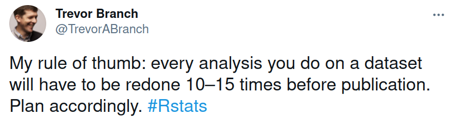
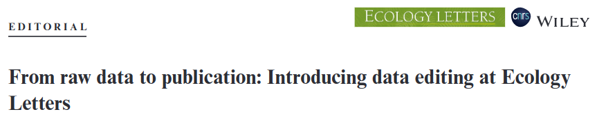
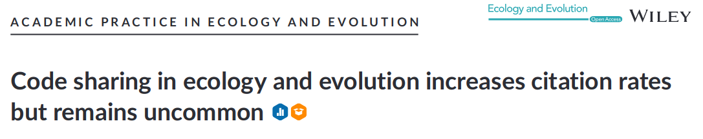
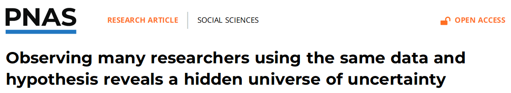
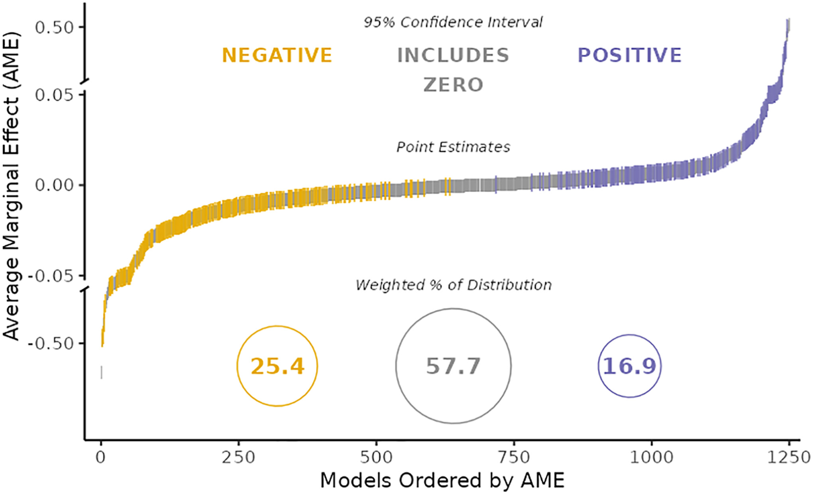

```{r include=FALSE}
library('knitr')
knitr::opts_chunk$set(echo = FALSE, cache = FALSE, background = 'red',
                      out.width = '80%',
                      # out.height = '2in', 
                      fig.align = 'center')
```


# Reproducibility: good for you, good for everyone

## Automation (good code) saves time

```{r }

```


## Code = fully traceable, reproducible analysis

:::::::::::::: {.columns align=center totalwidth=8em}
::: {.column width='50%'}
```{r }

```
:::
::: {.column width='50%'}
Code advantages:

- Easier writing

- Easier, deeper review

- Reusable
:::
::::::::::::::


::: hide :::

## Data without code NOT enough for reproducibility

```{r out.width='95%'}

```

\raggedright
\tiny [Hardwicke et al 2021](https://doi.org/10.1098/rsos.201494)
\raggedleft


## Same data -> different results 

Do soccer referees give more red cards to dark-skin players?

```{r out.width='95%'}

```

29 teams: 2/3 found significant effect 

\raggedright
\tiny [Silberzahn et al 2018](https://doi.org/10.1177%2F2515245917747646)
\raggedleft

:::

## Transparency prevents bad practices

```{r out.width='50%'}

```

```{r out.width='70%'}
include_graphics('images/Fraser-2018-fig.png')
```

p-hacking, HARKing, data fabrication...


\raggedright
\tiny [Fraser et al 2018](https://doi.org/10.1371/journal.pone.0200303)
\raggedleft


## Transparency avoids unnecessary disputes

```{r}

```

```{r}

```


## Transparency brings better science

```{r out.width='70%'}

```


## Many journals (and funders) value/require reproducibility

```{r out.width='90%'}

```

```{r out.width='20%', fig.align='right'}

```


## Many journals value reproducibility

'Papers with exemplary **data and code archiving**

are **more valuable** for future research and [...]

will be given **higher priority** for publication'


(*Molecular Ecology*)


## Many journals require reproducibility

```{r out.width='90%'}

```

'We require the **data and code** for reproducing statistical results and generating figures and  tables'

'This material will need to be supplied at the **time of submission**'


## Higher impact: cites, reuse, reputation

```{r}

```

\raggedright
\tiny [Colavizza et al 2020](https://doi.org/10.1371/journal.pone.0230416)
\raggedleft


```{r}

```

\raggedright
\tiny [Maitner et al 2024](https://doi.org/10.1002/ece3.70030)
\raggedleft


## Let's stop losing data & code 

```{r out.width='40%', fig.align='left'}

```

```{r out.width='60%'}

```

\raggedright
\tiny [Vines et al 2014](https://doi.org/10.1016/j.cub.2013.11.014)
\raggedleft


## Open data & code enable synthesis

```{r out.width='60%', fig.align='left'}

```

```{r }

```

\raggedright
\tiny [Wolkovich et al 2012](https://doi.org/10.1111/j.1365-2486.2012.02693.x)
\raggedleft
 
 

## Open data & code enable synthesis

```{r out.width='60%', fig.align='left'}

```

```{r out.width='60%'}

```

\raggedright
\tiny [Wolkovich et al 2012](https://doi.org/10.1111/j.1365-2486.2012.02693.x)
\raggedleft


::: hide :::

## Reproducible workflows facilitate collaboration

and make everyone happier

```{r echo=FALSE, out.width='90%'}

```

:::


## Same data -> different results 

Do soccer referees give more red cards to dark-skin players?

```{r out.width='95%'}

```

29 teams: 2/3 found significant effect 

\raggedright
\tiny [Silberzahn et al 2018](https://doi.org/10.1177%2F2515245917747646)
\raggedleft


## 73 teams testing the same hypothesis with the same data

```{r out.width='60%', fig.align='left'}

```

```{r out.width='50%'}

```

'This reveals a **universe of uncertainty** that remains hidden when considering a single study in isolation'

'These results call for greater **epistemic humility** and **clarity in reporting** scientific findings'

\raggedright
\tiny [Breznau et al 2022](https://doi.org/10.1073/pnas.2203150119)
\raggedleft


## 132 teams asking same question with same data

How does sibling competition affect nestling growth in blue tits?

```{r out.width='50%'}
include_graphics('images/Gould.png')
```


