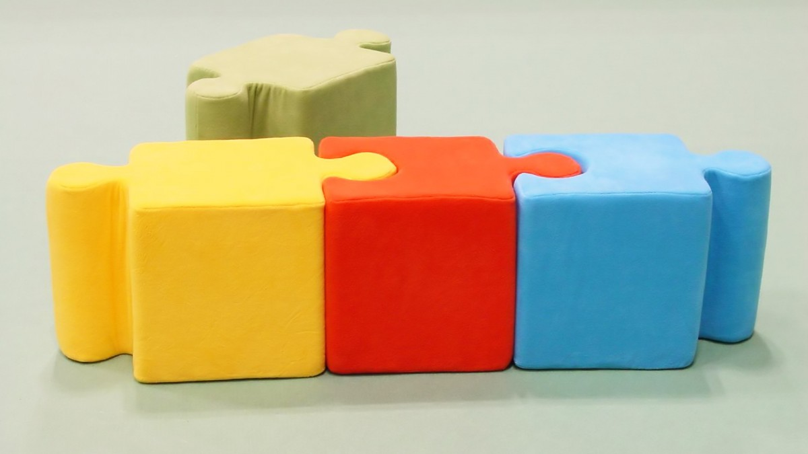

```{r include=FALSE, cache=FALSE}

library('knitr')

### Chunk options ###

## Text results
opts_chunk$set(echo = TRUE, eval = FALSE, warning = FALSE, message = FALSE, size = 'tiny')

opts_template$set(fig = list(echo = FALSE, eval = TRUE))

## Code decoration
opts_chunk$set(tidy = FALSE, comment = NA, highlight = TRUE, prompt = FALSE, crop = TRUE)

# ## Cache
# opts_chunk$set(cache = TRUE, cache.path = 'knitr_output/cache/')

# ## Plots
# opts_chunk$set(fig.path = 'knitr_output/figures/')
opts_chunk$set(fig.align = 'center', out.width = '80%')

### Hooks ###
## Crop plot margins
knit_hooks$set(crop = hook_pdfcrop)

## Reduce font size
## use tinycode = TRUE as chunk option to reduce code font size
# see http://stackoverflow.com/a/39961605
knit_hooks$set(tinycode = function(before, options, envir) {
  if (before) return(paste0('\n \\', options$size, '\n\n'))
  else return('\n\n \\normalsize \n')
  })

```


---

In complex projects we must **keep pieces organised**

```{r opts.label = 'fig'}

```


## `makefile` runs all code in right order

`makefile.R`

```{r }
source('clean_data.R')

source('fit_model.R')

render('report.Rmd')
```


::: hide :::
## Script runs code in right order

\tiny https://github.com/Pakillo/exclosures-Almoraima

\scriptsize

```{r }
#### READ AND PREPROCESS DATA #####

## Read site info
read_siteinfo('data-raw/sites_info_raw.csv')

## Read and prepare species info
read_sppinfo(sppdata = 'data-raw/species_info_raw.csv')

## Prepare dataset
make_dataset()


#### EXPLORATORY ANALYSIS ####
rmarkdown::render('analyses/EDA.Rmd')


#### MANUSCRIPT ####
rmarkdown::render('manuscript/cercados_Almoraima/cercados_Almoraima.Rmd')
```

\normalsize
:::


## `targets`: advanced workflow management

```{r opts.label = 'fig'}
include_graphics('images/drake-plan.png')
```

\footnotesize https://docs.ropensci.org/targets/


# Your turn

---

- Write makefile.R for your project

- Try `targets` minimal example 

- https://github.com/wlandau/targets-minimal

